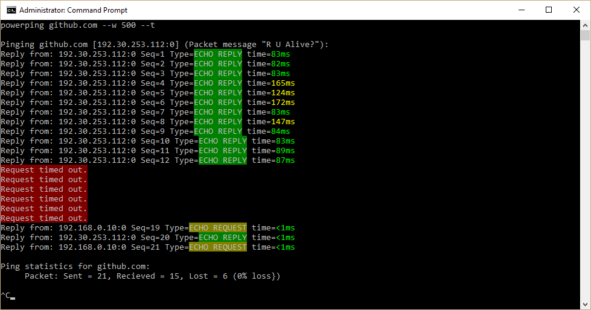

# PowerPing - Advanced Windows Ping 

Small improved command line ICMP ping program lovingly inspired by windows and unix, written in C#.
***

## Usage: 
     PowerPing [--?] | [--whoami] | [--location address] | [--listen] |
			   [--graph address] | [--t] [--c count] [--w timeout] [--m message] 
			   [--i TTL] [--in interval] [--pt type] [--pc code] [--4] target_name

## Arguments:
     --?             Displays this help message
     --t             Ping the target until stopped (Control-C to stop)
     --c count       Number of pings to send
     --w timeout     Time to wait for reply (in milliseconds)
     --m message     Ping packet message
     --i ttl		 Time To Live
     --in interval   Interval between each ping (in milliseconds)
	 --pt type       Use custom ICMP type
	 --pc code       use custom ICMP code value
     --4             Force using IPv4
     
     --graph address Ping an address, display results in graph view
	 
     --whoami        Location info for current host
     --location addr Location info for an address
     
     --listen	     Listen for ICMP packets

## Examples:
     powerping 8.8.8.8                    -     Send ping to google DNS with default values (3000ms timeout, 5 pings)
     powerping github.com --w 500 --t     -     Send pings indefinitely to github.com with a 500ms timeout
     powerping 127.0.0.1 --m Meow         -     Send ping with packet message "Meow" to loopback address
	 powerping 127.0.0.1 --pt 3 --pc 2    -     Send ping with ICMP type 3 (dest unreachable)
     
## Features

- [x] Colour coded response times
- [x] Displays type and code of each ICMP packets
- [x] Capture all ICMP communications for a computer
- [x] Customisable ping payloads
- [x] Detailed graph and statistical views
- [x] IP location querying and whoami 
- [ ] Local network scanning and host discovery
- [ ] Ping Flooding
- [ ] Send pings with custom types and size
- [ ] Trace route functionality
- [ ] Full IPv6 support

### Note: 
**Requires _Elevated Rights (Admininstrator)_ to Run**

*Written by Matthew Carney [matthewcarney64@gmail.com] =^-^=*
