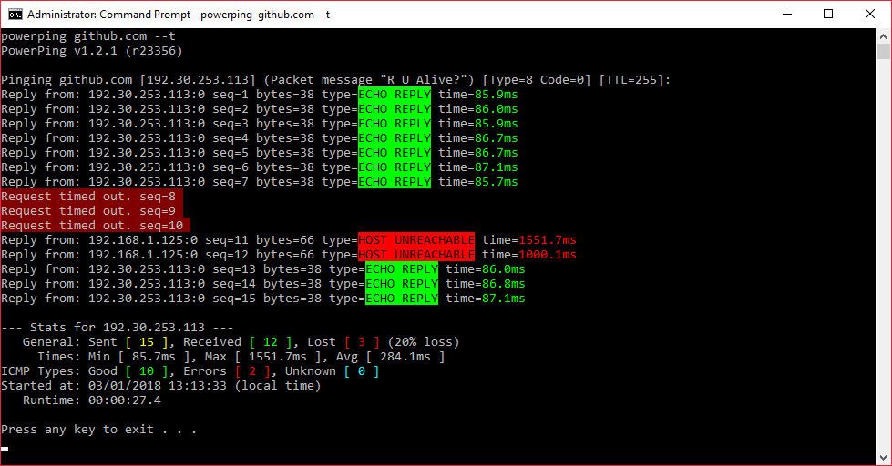
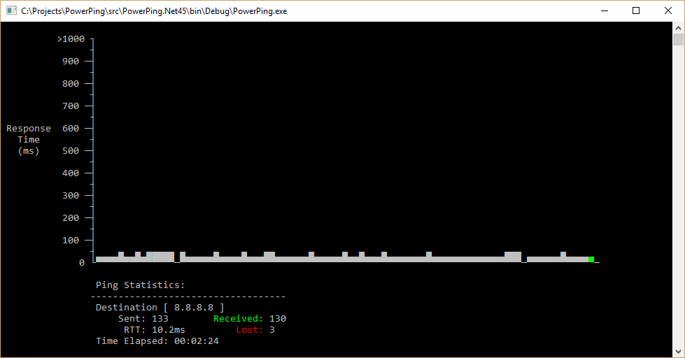
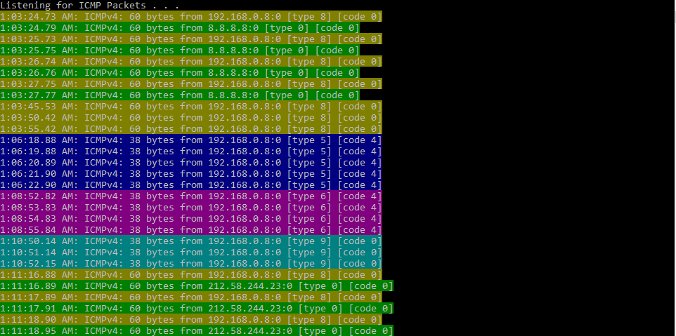
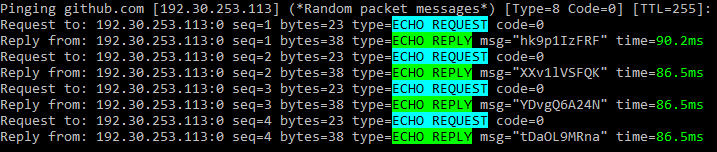
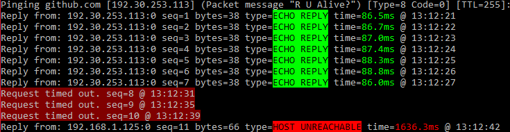

# PowerPing - Advanced Windows Ping 

   

Small improved command line ICMP ping program lovingly inspired by windows and linux, written in C#.

Download it here: [[Stable Releases]](https://github.com/Killeroo/PowerPing/releases)

Nightly Builds: [[Master]](https://ci.appveyor.com/api/projects/killeroo/powerping/artifacts/build%2Fx64%2FPowerPing.exe?job=Platform%3A%20x64&branch=master) [[Development]](https://ci.appveyor.com/api/projects/killeroo/powerping/artifacts/build%2Fx64%2FPowerPing.exe?job=Platform%3A%20x64&branch=dev) (x86 versions for [master](https://ci.appveyor.com/api/projects/killeroo/powerping/artifacts/build%2Fx86%2FPowerPing.exe?job=Platform%3A%20x86&branch=master) & [dev](https://ci.appveyor.com/api/projects/killeroo/powerping/artifacts/build%2Fx86%2FPowerPing.exe?job=Platform%3A%20x86&branch=dev))
***

## Features

PowerPing contains the following features:

- Basic ping functionality
- Coloured output
- Display options
- [ICMP packet customisation](https://en.wikipedia.org/wiki/Internet_Control_Message_Protocol#Control_messages)
- [Scanning](https://en.wikipedia.org/wiki/Ping_sweep)
- [Flooding](https://en.wikipedia.org/wiki/Ping_flood)
- [ICMP packet capture (/listen)](docs/screenshots/screenshot3.png)
- [IP location lookup](docs/screenshots/screenshot4.png)
- [Whois lookup](https://en.wikipedia.org/wiki/WHOIS)
- [Graphing](docs/screenshots/screenshot2.png)

The following features are planned for a future release:

- [Traceroute (target: v1.3.5)](https://en.wikipedia.org/wiki/Traceroute)
- [Tunnelling (target: v1.4.0)](https://en.wikipedia.org/wiki/ICMP_tunnel)
- [IPv6/ICMPv6 (target: v1.4.0)](https://en.wikipedia.org/wiki/Internet_Control_Message_Protocol_version_6)

## Usage: 
     PowerPing [--?] | [--ex] | [--li] | [--whoami] | [--whois] | [--loc] | [--fl] | [--sc] |
               [--g] | [--cg] | [--t] [--4] [--rng] [--df] [--rb number] [--b number] 
               [--c number] [--w number] [-i number] [--in number] [--pt number] [--pc number]
               [--m "message"] [--ti timing] [--sh] [--dm] [--ts] [--nc] [--input] [--s] [--r]
               [--nt] [--q] [--res] [--ia] [--l number] [dp number] target_name | target_address
               
## Arguments:
    Ping Options:
        --infinite   [--t]            Ping the target until stopped (Ctrl-C to stop)
        --ipv4       [--4]            Force using IPv4
        --random     [--rng]          Generates random ICMP message
        --dontfrag   [--df]           Set 'Don't Fragment' flag
        --buffer     [--rb]  number   Sets recieve buffer size (default is 5096)
        --beep       [--b]   number   Beep on timeout (1) or on reply (2)
        --count      [--c]   number   Number of pings to send
        --timeout    [--w]   number   Time to wait for reply (in milliseconds)
        --ttl        [--i]   number   Time To Live for packet
        --interval   [--in]  number   Interval between each ping (in milliseconds)
        --type       [--pt]  number   Use custom ICMP type
        --code       [--pc]  number   Use custom ICMP code value
        --message    [--m]   message  Ping packet message
        --timing     [--ti]  timing   Timing levels:
                                            0 - Paranoid    4 - Nimble
                                            1 - Sneaky      5 - Speedy
                                            2 - Quiet       6 - Insane
                                            3 - Polite      7 - Random
    
    Display Options:
        --shorthand  [--sh]           Show less detailed replies
        --displaymsg [--dm]           Display ICMP message contents
        --timestamp  [--ts]           Display timestamp
        --nocolor    [--nc]           No colour
        --input                       Require user input
        --symbols    [--s]            Renders replies and timeouts as ASCII symbols
        --request    [--r]            Show request packets
        --notimeouts [--nt]           Don't display timeout messages
        --quiet      [--q]            No output, only shows summary upon completion or exit
        --resolve    [--res]          Resolve hostname of address from DNS
        --inputaddr  [--ia]           Show input address instead of revolved one
        --limit      [--l]   number   Limits output to just replies (0) or requests (1)
        --decimals   [--dp]  number   Num of decimal places to use (0 to 3)

    Features:
        --scan       [--sc]  address  Network scanning, specify range "127.0.0.1-55"
        --listen     [--li]  address  Listen for ICMP packets
        --flood      [--fl]  address  Send high volume of pings to address
        --graph      [--g]   address  Graph view
        --compact    [--cg]  address  Compact graph view
        --location   [--loc] address  Location info for an address
        --whois              address  Whois lookup for an address
        --whoami                      Location info for current host

    Others:
        --help       [--?]            Displays this help message
        --version    [--v]            Shows version and build information
        --examples   [--ex]           Shows example usage

## Examples:
     powerping 8.8.8.8                    -     Send ping to google DNS with default values (3000ms timeout, 5 pings)
     powerping github.com --w 500 --t     -     Send pings indefinitely to github.com with a 500ms timeout
     
     powerping 127.0.0.1 --m Meow         -     Send ping with packet message "Meow" to loopback address
     powerping 127.0.0.1 --pt 3 --pc 2    -     Send ping with ICMP type 3 (dest unreachable) and code 2
     
     powerping 8.8.8.8 /c 5 -w 500 --sh   -     Different argument switches (/, - or --) can be used in any combination
     powerping google.com /ti Paranoid    -     Sends using the 'Paranoid' timing option
     powerping google.com /ti 1           -     Same as above

## Screenshots

[More screenshots](docs/screenshots/)

## Contribution

Feel free to [file issues or request features](https://github.com/Killeroo/PowerPing/issues) and submit [pull requests](https://github.com/Killeroo/PowerPing/pulls) – contributions are welcome.

## License

PowerPing is licensed under the [MIT license](LICENSE).

### Note: 
**Requires _Elevated Rights (Admininstrator)_ to Run**

*Written by Matthew Carney [matthewcarney64@gmail.com] =^-^=*
