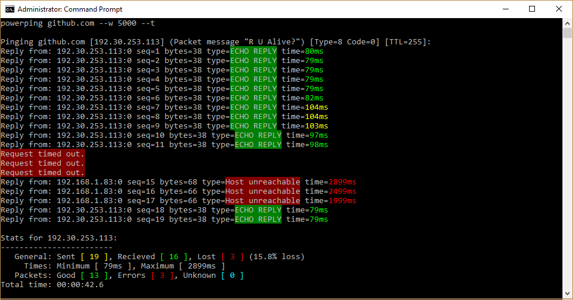

# PowerPing - Advanced Windows Ping 

Small improved ICMP ping program lovingly inspired by windows and unix, written in C#.

# Usage: 
     PowerPing [--?] | [--whoami] | [--location address] | [--t] 
			   [--c count] [--w timeout] [--m message] [--i TTL]
			   [--in interval] [--4] target_name

# Options:
     --?             Displays this help message
     --t             Ping the target until stopped (Control-C to stop)
     --c count       Number of pings to send
     --w timeout     Time to wait for reply (in milliseconds)
     --m message     Ping packet message
	 --i ttl		 Time To Live
	 --in interval   Interval between each ping (in milliseconds)
     --4             Force using IPv4	 
	 
     --whoami        Location info for current host
     --location addr Location info for an address	 

# Example:
     powerping 8.8.8.8                    -     Send ping to google DNS with default values (3000ms timeout, 5 pings)
     powerping github.com --w 500 --t     -     Send pings indefinitely to github.com with a 500ms timeout
     powerping 127.0.0.1 --m Meow         -     Send ping with packet message "Meow" to loopback address
     
# Note: 
     Requires Administrator to Send Pings

Written by Matthew Carney [matthewcarney64@gmail.com] =^-^=
